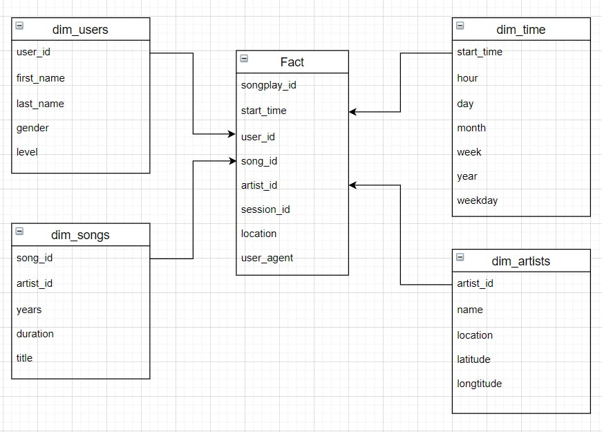
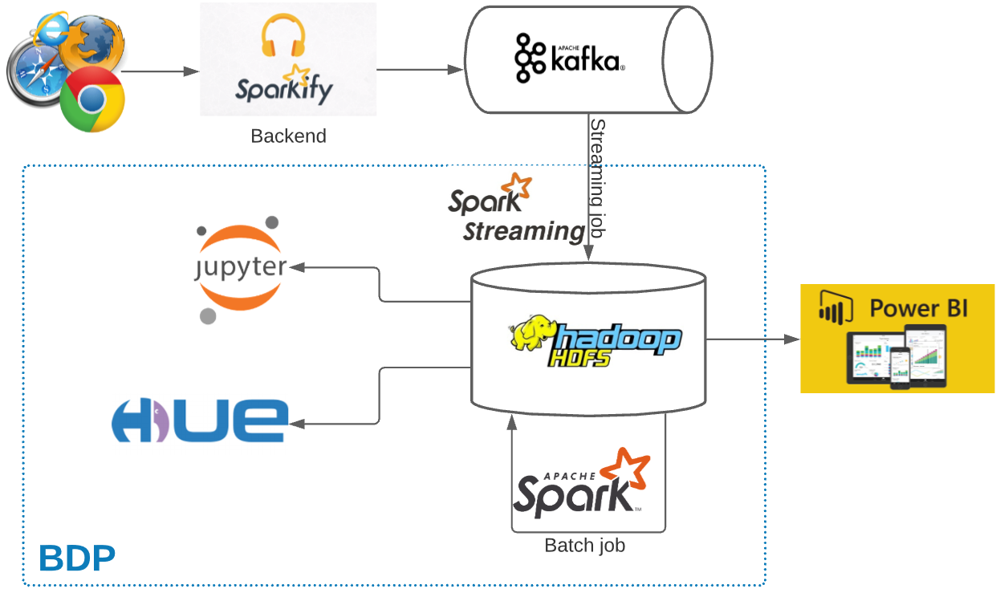
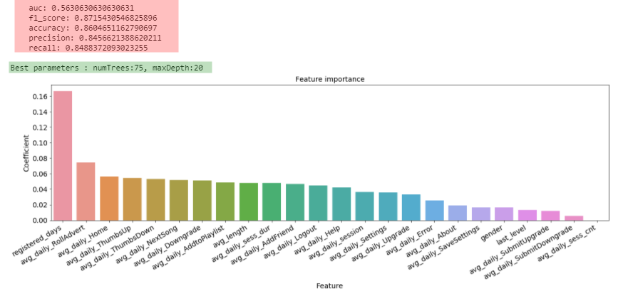

# Music Data Pipeline Projects


## Business understanding
We assume that user of Sparkify can be either Premium or Free Tier subscription, The premium plan with subscription fee and enjoy more songs without advertisements.
As an end user, he/she can do:

* Upgrade from free tier to Premium subscription
* Downgrade from Premium to free tier
* Drop their account and leave the service

The goals are:

* Analyse data
* Extract insights to identify churn indicators
* Build machine learning model to help predict potential churn ones
## Dataset
This is a public dataset named Million Song Dataset and can be download under json from <a href="http://millionsongdataset.com/">here</a> 
* Contains 18 columns which has the information of customers(gender, name, etc.) and API events(login, playing next song, etc.)
* Experiment period: 2018–10–01 to 2018–12–01
>
    {
        "ts":1543621857000,
        "userId":"300011",
        "sessionId":500,
        "page":"NextSong",
        "auth":"Logged In",
        "method":"PUT",
        "status":200,
        "level":"paid",
        "itemInSession":37,
        "location":"New York-Newark-Jersey City,NY-NJ-PA",
        "userAgent":"Mozilla/5.0 (compatible; MSIE 9.0; Windows NT 6.1; WOW64; Trident/5.0)",
        "lastName":"House",
        "firstName":"Emilia",
        "registration":1538336771000,
        "gender":"F",
        "artist":"Olive",
        "song":"You\\'re Not Alone",
        "length":264.12363
    }
>

## Task Summary
1. Write Dockerfile for set up enviroment using **Spark, Hadoop, Postgres, Airflow**, etc
2. Design data warehouse & build ETL Pipeline :
    * from raw json data into *PostgreSQL* locally for testing
    * from *S3 Storage* into *AWS Redshift* 
    * from *S3 Storage* into *AWS EMR* 
3. Streamming data for analyzing data using Kafka
4. Extract insights from data using PySpark
5. Predict churn rate on Sparkify services

## Data Modeling with Postgres
   <p align="left">
        
    </p>
Prerequisites: Database and tables created

- On the etl.py we start our program by connecting to the sparkify database, and begin by processing all songs related data.

- We walk through the tree files under /data/song_data, and for each json file encountered we send the file to a function called process_song_file.

- Here we load the file as a dataframe using a pandas function called read_json().

- For each row in the dataframe we select the fields we are interested in:

## ETL with Redshift

First, create an IAM role named `RedshiftRole` for Redshift with the policy 
`AmazonS3ReadOnlyAccess` in the AWS management console.

Start a Redshift cluster 
```sh
python run_on_aws.py
```

Print a summary of data on S3 (optional)
```sh
python summarize_data.py
```

Initialize all tables
```sh
python create_tables.py
```

Run the ETL pipeline
```sh
python etl.py
```

Example query result:
```sh
Number of rows in the staging events table:  8056
Number of rows in the staging songs table:  385252
Query result of song table:
 -  (384824,)
 -  ('SOPDWEJ12AB018BC6D', 'Spite', 'ARBBHDX1187B9B2EE7', 1992, Decimal('271'))
 -  ('SODNDRW12A6D4F98CD', 'Everything Is Alright (album version)', 'AR50H061187FB4AE1C', 2006, Decimal('193'))
 -  ('SOFMIWT12A8C141EE3', 'Heiliges Herz (Thomas Rainer - Remix)', 'AR1SQV21187B9AE9C6', 0, Decimal('290'))
 -  ('SOABWAP12A8C13F82A', 'Take Time', 'AR5LMPY1187FB573FE', 1978, Decimal('258'))
 -  ('SOLOOSA12AC4688A3C', 'Corazon Partio Club Mix Edit', 'ARQATCR1187FB4D3E6', 0, Decimal('270'))
Query result of artist table:
 -  (45266,)
 -  ('AR1RHCO1187B9AF0BF', 'Vince Guaraldi / Bola Sete', 'San Francisco, CA', Decimal('37'), Decimal('-122'))
 -  ('ARIRDVY1187FB587CC', 'The Beautiful Girls', 'Sydney, New South Wales, Australi', Decimal('-33'), Decimal('151'))
 -  ('ARLTWXK1187FB5A3F8', 'King Curtis', 'Fort Worth, TX', Decimal('32'), Decimal('-97'))
 -  ('ARDWGXO1187FB5BFD6', 'Ian Siegal', '', None, None)
 -  ('AR7RUDQ1187B98C147', 'Alabama Thunderpussy', '', None, None)
Query result of time table:
 -  (6813,)
 -  (datetime.datetime(2018, 11, 3, 1, 5, 50, 796000), 1, 3, 44, 11, 2018, 6)
 -  (datetime.datetime(2018, 11, 3, 14, 17, 50, 796000), 14, 3, 44, 11, 2018, 6)
 -  (datetime.datetime(2018, 11, 3, 15, 54, 48, 796000), 15, 3, 44, 11, 2018, 6)
 -  (datetime.datetime(2018, 11, 3, 16, 10, 32, 796000), 16, 3, 44, 11, 2018, 6)
 -  (datetime.datetime(2018, 11, 3, 16, 29, 46, 796000), 16, 3, 44, 11, 2018, 6)
Query result of user table:
 -  (105,)
 -  (53, 'Celeste', 'Williams', 'F', 'free')
 -  (95, 'Sara', 'Johnson', 'F', 'paid')
 -  (49, 'Chloe', 'Cuevas', 'F', 'free')
 -  (8, 'Kaylee', 'Summers', 'F', 'free')
 -  (14, 'Theodore', 'Harris', 'M', 'free')
Query result of songplay table:
 -  (7268,)
 -  (8, datetime.datetime(2018, 11, 29, 21, 0, 3, 796000), 80, 'paid', 'SOXQYSC12A6310E908', 'AR0L04E1187B9AE90C', 1065, 'Portland-South Portland, ME', '"Mozilla/5.0 (Macintosh; Intel Mac OS X 10_9_4) AppleWebKit/537.36 (KHTML, like Gecko) Chrome/36.0.1985.143 Safari/537.36"')
 -  (24, datetime.datetime(2018, 11, 13, 19, 11, 19, 796000), 97, 'paid', 'SOQSYGY12A8C137E0F', 'AROF4LP1187FB41C51', 537, 'Lansing-East Lansing, MI', '"Mozilla/5.0 (X11; Linux x86_64) AppleWebKit/537.36 (KHTML, like Gecko) Chrome/37.0.2062.94 Safari/537.36"')
 -  (40, datetime.datetime(2018, 11, 29, 1, 38, 30, 796000), 24, 'paid', 'SOTNHIP12AB0183131', 'ARD46C811C8A414F3F', 984, 'Lake Havasu City-Kingman, AZ', '"Mozilla/5.0 (Windows NT 6.1; WOW64) AppleWebKit/537.36 (KHTML, like Gecko) Chrome/36.0.1985.125 Safari/537.36"')
 -  (56, datetime.datetime(2018, 11, 6, 23, 32, 39, 796000), 97, 'paid', 'SOBRFPG12A8AE4837D', 'AR1N3PB1187B9B25C1', 293, 'Lansing-East Lansing, MI', '"Mozilla/5.0 (X11; Linux x86_64) AppleWebKit/537.36 (KHTML, like Gecko) Chrome/37.0.2062.94 Safari/537.36"')
 -  (72, datetime.datetime(2018, 11, 27, 18, 22, 58, 796000), 36, 'paid', 'SODFRAX12A8C13274B', 'ARP29T31187B98DD5F', 957, 'Janesville-Beloit, WI', '"Mozilla/5.0 (Windows NT 5.1) AppleWebKit/537.36 (KHTML, like Gecko) Chrome/36.0.1985.143 Safari/537.36"')
```

**Don't forget to delete the Redshift cluster!**
```sh
python run_on_aws.py --delete
```

## ETL on Spark EMR
We will run the ETL pipeline on Amazon Elastic MapReduce (Amazon EMR).
Amazon EMR is the industry-leading cloud big data platform for processing vast 
amounts of data using open source tools such as Apache Spark, Apache Hive, 
Apache HBase, Apache Flink, Apache Hudi, and Presto. Amazon EMR makes it easy 
to set up, operate, and scale your big data environments by automating 
time-consuming tasks like provisioning capacity and tuning clusters. With EMR 
you can run petabyte-scale analysis at less than half of the cost of 
traditional on-premises solutions and over 3x faster than standard Apache 
Spark. You can run workloads on Amazon EC2 instances, on Amazon Elastic 
Kubernetes Service (EKS) clusters, or on-premises using EMR on AWS Outposts.

#### Create a EC2 key pair

```sh
# Set the permission of the private key file.
chmod 400 <path/to/the/pem/file>
```

#### Create default roles in IAM.
```sh
aws emr create-default-roles
```


#### Start an EMR cluster 
```sh
# create a default subnet which is required to run the EMR notebook (optional)
aws ec2 create-default-subnet --availability-zone <your zone name>

# create the EMR cluster
# Caveat: Kernel error occurs when using Jupyter notebook with emr-5.32.0!
aws emr create-cluster --release-label emr-5.29.0 \
                       --instance-type m5.xlarge \
                       --instance-count 3 \
                       --name data-lake-emr \
                       --use-default-roles \
                       --applications Name=Spark Name=Livy \
                       --ec2-attributes SubnetId=<your subnet Id name>,KeyName=<your permission key name>

# optional
aws emr describe-cluster --cluster-id <ClusterId>
```

#### Modify the security group

This step is required for only once and can be skipped next time!.

Caveat: Your IP address could vary from time to time!

```sh
# Show EMR security group names and IDs.
aws ec2 describe-security-groups --filters Name=group-name,Values="ElasticMapReduce-*" \
                                 --query "SecurityGroups[*].{Name:GroupName,ID:GroupId}"

# Allow connect to the master node via ssh. 
aws ec2 authorize-security-group-ingress --group-id <ElasticMapReduce-master ID> \
                                         --protocol tcp \
                                         --port 22 \
                                         --cidr <IP address>/24

# Show details of the modified security group.
aws ec2 describe-security-groups --group-ids <ElasticMapReduce-master ID>
```

One can find the IP address at https://checkip.amazonaws.com/

#### Establish ssh connection to the master node

```sh
# Verify that you can ssh to the master node.
ssh -i <path/to/the/pem/file> hadoop@<MasterPublicDnsName>

# Open a SSH tunnel with port:
# - 18080: Spark history server
# -  8088: YARN ResourceManager
# - 50070: Hadoop file system
ssh -i <path/to/the/pem/file> -N -L 8157:<MasterPublicDnsName>:<port> hadoop@<MasterPublicDnsName>
```

Open a local browser and go to http://localhost:8157

#### Run EDA using EMR notebook (optional)

Example [Jupyter notebook](./spartify.ipynb)

#### Run the ETL pipeline

```sh
# Copy the file to the cluster.
scp -i <path/to/the/pem/file> etl.py hadoop@<MasterPublicDnsName>:~/

# Set Pyspark Python version
sudo sed -i -e '$a\export PYSPARK_PYTHON=/usr/bin/python3' /etc/spark/conf/spark-env.sh

# Run the pipeline.
ssh -i <path/to/the/pem/file> hadoop@<MasterPublicDnsName>
spark-submit etl.py
```

#### Terminate the EMR cluster
```sh
aws emr list-clusters --active
aws emr terminate-clusters --cluster-ids <ClusterId>
```

## Streamming data with Kafka and extract insight
 <p align="left">
        
    </p>
### How to run project
I used our available Yarn cluster with infrastructure supporting Kafka, Spark, Hadoop services. This can be achievable with 
[Amazon EMR - Big Data Platform](https://aws.amazon.com/emr/?whats-new-cards.sort-by=item.additionalFields.postDateTime&whats-new-cards.sort-order=desc).

- How to run the `Kafka producer`:
    * Extract the `medium-sparkify-event-data.json.gz` in data folder
    * Run `python kafka_producer.py --time_interval 1` to send every message per second

- How to run `Spark streaming application`:
    * At the current project, run `./deploy` script
    * It will submit our pyspark application to Yarn cluster and start consume message sent from Kafka.

- The running opration once executing above two commands can be seen as below:
    <p align="left">
        
    </p>

### Result summary
* The business problem to solve: predict churn rate
* The metrics selected for evaluating the result: `f1 score`. The churn rate in practice is dominant by non-churn ones (22% vs 78% for the provided dataset), `f1` is chosen because it is to balance the precision (predict right churn person) and recall (not to miss the churn person).
* Select machine learning algorithm: `Random Forest` as it provides better score comparing to other evalated ML algorithms `Logistic Regression` and `Gradient Boosted Trees`.
* `f1 score` = `0.87` which is fairly good.
* Top features contributing to `churn rate` are registered_days, rolling advert, etc. which are valuable information for product team to improve the service for better customer retention.

    <p align="left">
        
    </p>

## Orchestration with Airflow to pull data from S3 to Redshift

# PART 2 - Cluster creation

We enter to the AWS console and we  create cluster on Amazon Reshift cluster


In this project I will use a **Free trial**


With the database configurations

Dabase name:  **dev**

Database port: **5439**

Master username: **awsuser**

Master password:  \****


We should add to the cluster permissions to read S3 buckets


with Iam roles


with Permissions policies  in json:

```json
{
    "Version": "2012-10-17",
    "Statement": [
        {
            "Effect": "Allow",
            "Action": [
                "s3:Get*",
                "s3:List*"
            ],
            "Resource": "*"
        }
    ]
}
```


# PART 3 - Airflow Connections

Here, we'll use Airflow's UI to configure your AWS credentials and connection to Redshift.

1. To go to the Airflow UI:
   - We run Airflow locally, open [http://localhost:8080](http://localhost:8080/) in Google Chrome (other browsers occasionally have issues rendering the Airflow UI).
2. Click on the **Admin** tab and select **Connections**.


1 Under **Connections**, select **Create**.


2 On the create connection page, enter the following values:

- **Conn Id**: Enter `aws_credentials`.
- **Conn Type**: Enter `Amazon Web Services`.
- **Login**: Enter your **Access key ID** from the IAM User credentials you downloaded earlier.
- **Password**: Enter your **Secret access key** from the IAM User credentials you downloaded earlier.

Once you've entered these values, select **Save and Add Another**.


3 On the next create connection page, enter the following values:

- **Conn Id**: Enter `redshift`.
- **Conn Type**: Enter `Postgres`.
- **Host**: Enter the endpoint of your Redshift cluster, excluding the port at the end. You can find this by selecting your cluster in the **Clusters** page of the Amazon Redshift console. See where this is located in the screenshot below. IMPORTANT: Make sure to **NOT** include the port at the end of the Redshift endpoint string.
- **Schema**: Enter `dev`. This is the Redshift database you want to connect to.
- **Login**: Enter `awsuser`.
- **Password**: Enter the password you created when launching your Redshift cluster.
- **Port**: Enter `5439`.

Once you've entered these values, select **Save**.


Awesome! You're now all configured to run Airflow with Redshift.


## PART 4  Run DAG

Start the DAG by switching it state from OFF to ON.


In the DAG, add `default parameters` according to these guidelines

- The DAG does not have dependencies on past runs

- On failure, the task are retried 3 times

- Retries happen every 5 minutes

- Catchup is turned off

- Do not email on retry


Refresh the page and click on the awst_redshift_dag to view the current state. It will take time to run the complete DAG


You should be able to execute the DAG successfully, but if you check the logs, you will see only `operator not implemented` messages.
